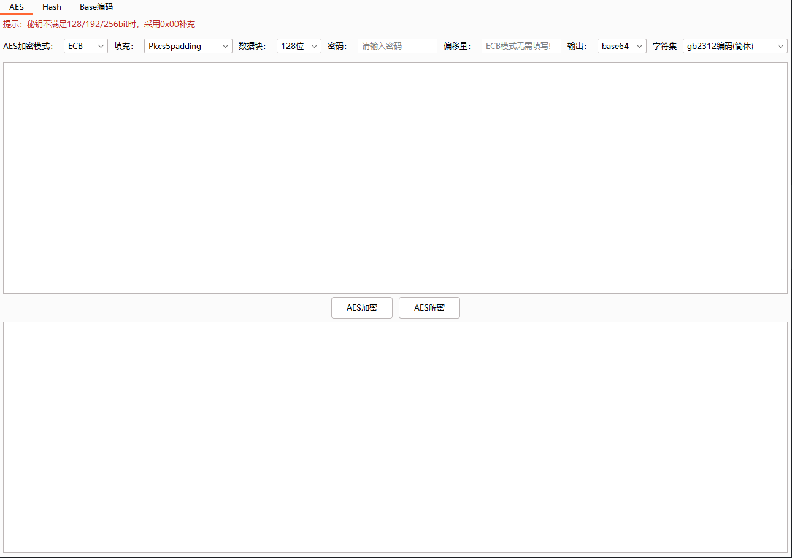
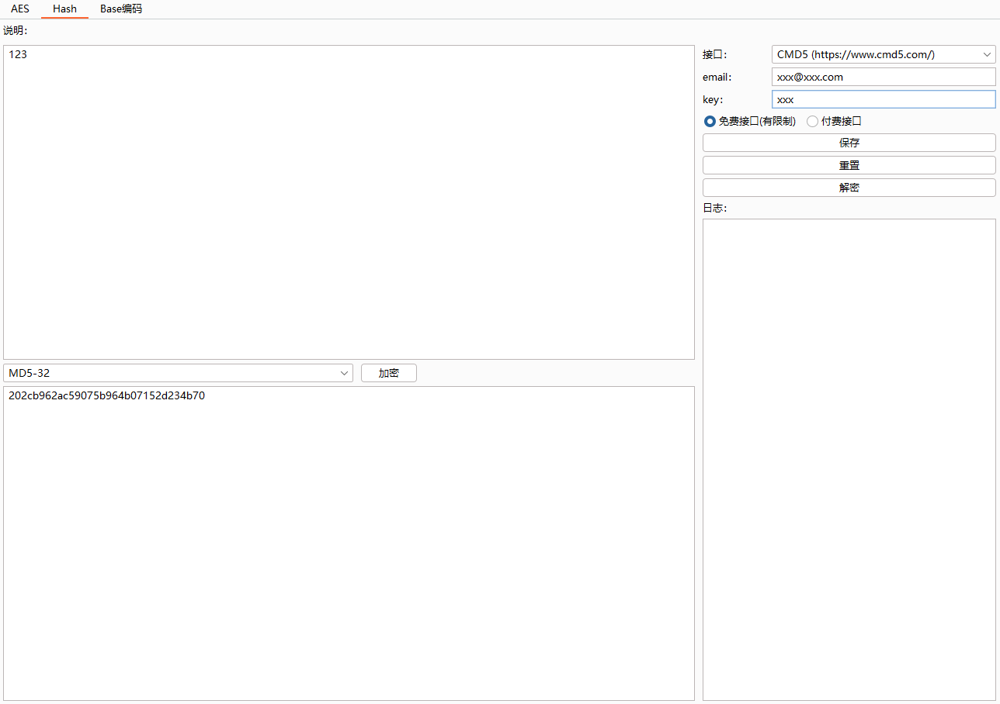
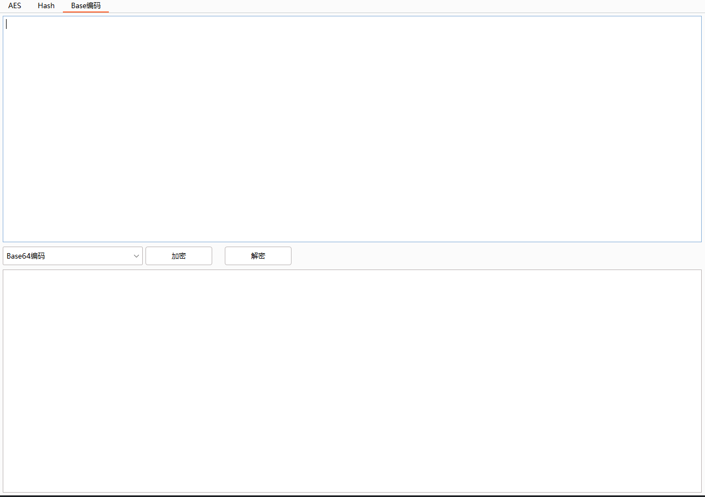

# Encrypt365

### 贡献者

<!-- readme: Contributes -start -->
<!-- readme: Contributes -end -->

### 使用环境

- 1.JDK ≥ 17
- 2.BurpSuite ≥ v2023.1

### 功能介绍

    1. 支持AES，支持ECB/CBC/CTR/OFB/CFB/CTS/PCBC加密模式

    2. 支持Base，支持Base64/Base32/Base16/Base58/Base91编码

    3. 支持哈希摘要，支持MD5-32位/MD5-16位/SHA-1/SHA-224/SHA-256/SHA-384/SHA-512
       支持MD5在线接口解密(已对接https://cmd5.com/)
    ps:有好用的MD5解密接口联系我（kang4me@163.com or Issues）

    4. 支持非对称加密，支持RSA密钥对加解密/RSA密钥对生成（功能待完善）

    n. 随缘更新...

### 二开环境

以下是作者开发环境：
    
    1. jdk17.0.8
    
    2. apache-maven-3.5.0
    
    3. BurpSuite新版API接口 montoya-api
    
    4. IntelliJ IDEA 2023.1

### 插件界面

